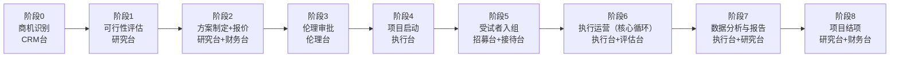
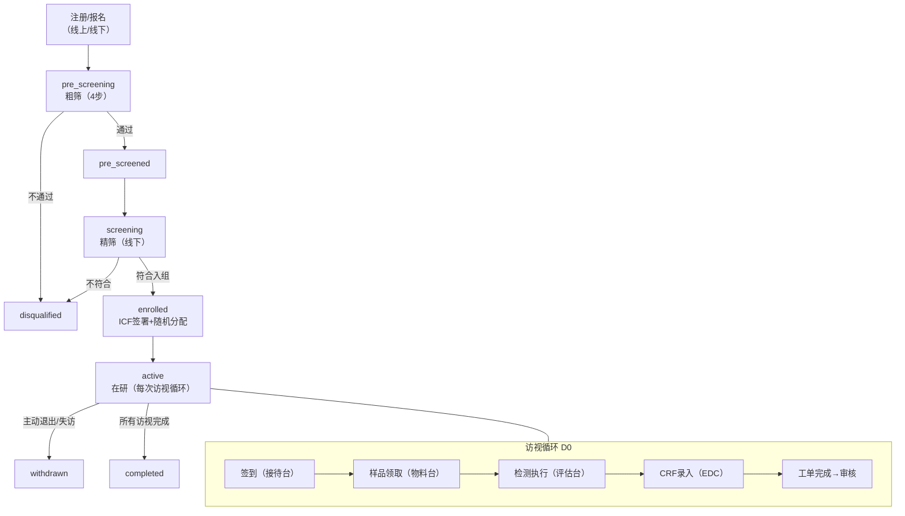
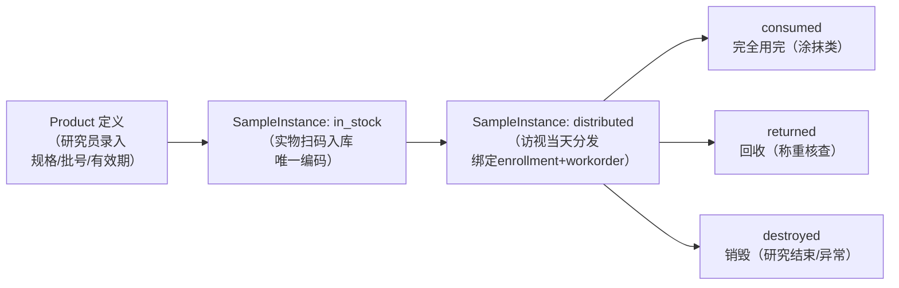

# CN KIS V1.0 业务全景总库

> 版本：1.0 | 创建日期：2026-03-21 | 基于源材料：SYSTEM_ARCHITECTURE_AND_WORKFLOW_GUIDE / BUSINESS_FEATURES_SUMMARY / ROLE_BUSINESS_PANORAMA / RBAC_PERMISSION_SYSTEM / FULL_LIFECYCLE_COLLABORATION_ANALYSIS / EXECUTION_BUSINESS_PANORAMA
>
> 用途：V2.0 验收基线；确保每一个工作台、角色、流程、功能、数据项均有明确的业务定义与验收目标。

---

## 一、工作台全景（18 台）

| 序号 | 雅名·台名 | URL 前缀 | 核心定位 | 服务角色 | V2.0 状态 |
|---|---|---|---|---|---|
| 1 | 子衿·秘书台 | /secretary | 系统总控门户，统一待办/通知/预警/管理驾驶舱 | 全员（所有角色默认可见） | ✅ 继承 |
| 2 | 采苓·研究台 | /research | 研究者视角的项目全周期管理（方案→协议→结项→知识库） | researcher / researcher / project_director / tech_director | ✅ 继承 |
| 3 | 维周·执行台 | /execution | 临床试验运营指挥中枢，工单驱动的执行全程管理 | crc / crc_supervisor / scheduler / technician / clinical_executor | ✅ 继承 |
| 4 | 怀瑾·质量台 | /quality | 偏差/CAPA/数据质疑/审计/SOP 的质量合规体系 | quality_manager / qa / project_manager | ✅ 继承 |
| 5 | 管仲·财务台 | /finance | 报价→合同→发票→回款→利润分析的财务全链路 | finance_manager / finance | ✅ 继承 |
| 6 | 进思·客户台 | /crm | 客户档案、商机管道、满意度、售后工单的 CRM | sales_director / sales_manager / sales / customer_success / business_assistant | ✅ 继承 |
| 7 | 招招·招募台 | /recruitment | 受试者招募全流程（报名→粗筛→筛选→入组→礼金） | recruiter / project_manager | ✅ 继承 |
| 8 | 器衡·设备台 | /equipment | 设备台账、校准计划、维护工单、使用记录 | equipment_manager（隐含）/ it_specialist | ✅ 继承 |
| 9 | 度支·物料台 | /material | 产品/样品/耗材库存、出入库、效期预警、销毁审批 | scheduler / crc / project_manager | ✅ 继承 |
| 10 | 坤元·设施台 | /facility | 场地预约、环境监控、不合规事件、清洁记录 | scheduler / facility_manager（隐含） | ✅ 继承 |
| 11 | 衡技·评估台 | /evaluator | 技术评估员的工单接受→准备→执行→电子签名流程 | evaluator | ✅ 继承 |
| 12 | 共济·人员台 | /lab-personnel | 实验室人员资质矩阵、排班、工时、派工、风险预警 | hr_manager / project_manager | ✅ 继承 |
| 13 | 御史·伦理台 | /ethics | 伦理申请/批件/审查意见/合规检查/法规追踪 | qa / project_manager / researcher | ✅ 继承 |
| 14 | 和序·接待台 | /reception | 受试者队列叫号、签到签出、大屏投影 | receptionist / crc | ✅ 继承 |
| 15 | 时雨·人事台 | /hr | 公司人力资源（资质、胜任力模型、培训、绩效） | hr_manager / hr | ✅ 继承 |
| 16 | 天工·统管台 | /control-plane | IT 运维、资源事件、系统拓扑 | superadmin / it_specialist | ✅ 继承 |
| 17 | 鹿鸣·治理台 | /admin | 账号/角色/权限管理，系统治理 | superadmin / admin | ✅ 继承 → V2 合并入**鹿鸣·治理台(governance)** |
| 18 | 中书·智能台 | /digital-workforce | AI 对话、动作箱、执行回放、Claw 编排 | 全员（role_level ≥ L3）| ✅ 继承 + 扩展 |
| 19 | **鹿鸣·治理台** | /governance | 治理全功能（合并原admin+iam）（用户/角色/权限/会话/审计/AI使用）| admin / superadmin | **V2 新增**（V1 RBAC 演化） |
| 20 | **洞明·数据台** | /data-platform | 数据治理全平台（目录/知识/血缘/管线/质量/存储/拓扑/备份）| data_manager / superadmin | **V2 新增**（V1 数据治理演化） |

**本轮 V2 验收不纳入执行（归档仅）**：
- 微信小程序（受试者端 + 技术员端）
- 移动 App（mobile-rn）

---

## 二、角色全景（30 个主要角色）

### 2.1 管理层（L8-L10）

| 角色代码 | 角色名 | 数据作用域 | 主工作台 | 核心操作描述 |
|---|---|---|---|---|
| superadmin | 超级管理员 | global | 全部 18+ 台 | 系统治理、账号/角色管理、审计、权限配置、系统维护 |
| admin | 系统管理员 | global | 全部 + /admin + /iam | 账号/角色配置、权限分配、审计查看、工作台配置 |
| general_manager | 总经理 | global | 秘书+财务+研究+执行+质量+人事+客户+招募 | 跨台管理驾驶舱、P&L 监控、风险预警、战略决策支持 |
| sales_director | 商务总监 | global | 客户+财务+秘书 | 商机管道监控、客户战略、营收分析 |
| project_director | 项目总监 | global | 研究+执行+质量+招募+秘书 | 项目组合甘特图、资源调配、结项验收 |
| tech_director | 技术总监 | global | 秘书+研究+执行 | 方案技术审核、知识库管理、方法验证 |
| research_director | 研究总监 | global | 秘书+研究+质量 | 方案科学性审查、可行性评估、质量趋势 |

### 2.2 经理层（L6）

| 角色代码 | 角色名 | 数据作用域 | 主工作台 | 核心操作描述 |
|---|---|---|---|---|
| project_manager | 项目经理 | project（已分配） | 研究+执行+质量+秘书 | 协议激活→访视计划→工单→结项全流程 |
| quality_manager | 质量经理 | global | 质量+秘书 | 偏差7步推进→CAPA→审计→SOP审批→质量分析 |
| finance_manager | 财务经理 | global | 财务+秘书 | 报价→合同→发票→回款→分析报表全链 |
| hr_manager | 人力资源经理 | global | 人事+秘书 | 资质管理、胜任力模型、培训跟踪 |
| sales_manager | 销售经理 | global | 客户+秘书 | 客户新建、商机看板、满意度调研 |
| data_manager | 数据经理 | global | 研究+秘书+洞明 | 数据质量管理、EDC 模板、协议 AI 解析审核 |

### 2.3 执行层（L3-L5）

| 角色代码 | 角色名 | 数据作用域 | 主工作台 | 核心操作描述 |
|---|---|---|---|---|
| crc_supervisor | CRC 主管 | project | 执行+秘书 | 多项目交付指挥、团队负载矩阵、工单审批、进展通报 |
| scheduler | 排程专员 | project | 执行+秘书 | 排程生成/冲突检测/发布、工单分配、LIMS 同步 |
| crc | CRC 协调员 | project | 执行+秘书 | 工单执行全流程（SOP→清单→CRF→物料→完成）、签到接待 |
| technician | 技术员 | project | 执行+小程序（归档） | 扫码工单执行、eCRF 录入 |
| evaluator | 技术评估员 | project | 评估台+秘书 | 接受→准备→执行→签名完整流程、仪器 OCR 读数 |
| clinical_executor | 临床执行人员 | project | 执行+秘书 | 项目执行概览、工单执行 |
| researcher | 研究员 | project | 研究+秘书 | 方案设计、协议 AI 解析、访视计划、知识库、AI 助手 |
| recruiter | 招募专员 | project | 招募+秘书 | 报名跟进、粗筛4步、精筛、入组确认、礼金发放 |
| qa | QA 质量管理 | project | 质量+秘书 | 偏差报告、SOP 查看（无 CAPA 管理权，无 SOP 审批权） |
| sales | 销售代表 | personal | 客户+秘书 | 客户开发、商机跟进（仅个人数据范围） |
| customer_success | 客户成功经理 | global | 客户+秘书 | 健康度监控、满意度调研、售后工单 |
| finance | 财务人员 | global | 财务+秘书 | 报价/发票/回款/成本录入（无审批权） |
| hr | HR 专员 | global | 人事+秘书 | 查看人员/培训/评估（只读） |
| it_specialist | IT 专员 | global | 秘书+统管台 | 系统维护、基础功能 |
| data_analyst | 数据分析师 | project | 研究+秘书 | 知识库检索、AI 助手、数据分析 |
| business_assistant | 商务助理 | personal | 客户+秘书 | 辅助商务文档和客户档案 |
| viewer | 查看者 | personal | 秘书（只读） | 门户/待办/通知/AI 对话（新用户默认角色） |
| receptionist | 接待员 | project | 接待台+秘书 | 队列叫号、扫码签到、大屏投影 |

---

## 三、项目全生命周期（8 个阶段）



| 阶段 | 名称 | 主导工作台 | 协同工作台 | 核心数据/输出 | 关键验收断言 |
|---|---|---|---|---|---|
| 0 | 商机识别 | 客户台（CRM） | 秘书台 | Opportunity 记录、客户健康评分 | Opportunity 可创建/更新；健康评分逻辑可运算 |
| 1 | 可行性评估 | 研究台 | 秘书台（知识库） | FeasibilityAssessment、可行性报告 | 可行性评估可提交；知识库可检索历史同类研究 |
| 2 | 方案制定与报价 | 研究台 + 财务台 | 客户台 | Proposal（5状态）、Quote、Contract 草稿 | Protocol 可创建并流转到 draft→under_review；报价单可关联协议 |
| 3 | 伦理审批 | 伦理台 | 研究台、质量台 | EthicsApplication → approved、批件 eTMF 归档 | 伦理申请可提交→审查意见可回填→批件可上传 |
| 4 | 项目启动/资源准备 | 执行台 | 招募台、物料台、设备台、人员台 | Protocol 激活、排程计划、SampleInstance 入库、人员资质确认 | Protocol 可激活；排程计划可生成；人员资质矩阵可查看 |
| 5 | 受试者入组 | 招募台 + 接待台 | 执行台 | Enrollment 记录、ICF 签署、随机分配编号 | 受试者可完成4步粗筛→精筛→入组；ICF 可电子签署 |
| 6 | 执行运营 | 执行台 | 接待台、评估台、物料台、质量台 | WorkOrder 生命周期、CRFRecord、AE 记录 | 工单可从 pending→completed；CRF 可录入；AE 可上报 |
| 7 | 数据分析与报告 | 执行台（EDC）+ 研究台 | 质量台、伦理台、财务台 | 锁库 CRF 数据、AI 生成研究报告 | 数据可锁库（不可再编辑）；报告 AI 草稿可生成 |
| 8 | 项目结项 | 研究台 | 财务台、质量台、物料台、伦理台 | CloseoutChecklist（7项）、ProjectDebriefing、知识条目入图谱 | 结项清单7项可逐一确认；知识沉淀可入库 |

---

## 四、受试者视角生命周期



**依从性追踪维度**：
- 访视出勤率（expected_visits vs completed_visits）
- 日记完成率（diary_compliance_rate）
- 样品使用记录（自报 vs 实物核查）
- 退出原因分布（withdrew/lost_to_follow_up/excluded）

**关键状态机约束**：
- `active` 时不可直接跳 `completed`（必须访视计划全部通过）
- `disqualified` 为终态（不可逆）
- `withdrawn` 后可重新报名新协议（新 Enrollment，旧 Enrollment 不变）

**V2 新增验收断言**：
- PIPL 查阅权（`GET /subjects/{id}/privacy-report` → 200）
- PIPL 撤回同意（`POST /subjects/{id}/withdraw-consent` → 成功）
- 受试者假名化（AES-256-GCM，`SubjectPseudonym` 数据不明文存储）

---

## 五、样品视角生命周期



**关键约束**（V2 必须继承验证）：
- 每个 SampleInstance 必须绑定一个 Enrollment
- 盲态研究：编号加密，解盲前研究员不可见产品名
- 每次流转必须有 SampleTransaction 记录（不可删除，GCP）
- 有效期 ≤30 天 → 物料台自动告警
- 5 类样品类型（测试品/安慰剂对照品/阳性对照品/仪器标准品/耗材）管理规则各异

---

## 六、数据视角

### 6.1 核心数据链路

```
Protocol（协议）
  → VisitPlan（访视计划）→ VisitNode（访视节点）→ VisitActivity（活动）
  → SchedulePlan（排程计划）→ ScheduleSlot（时间槽）
  → WorkOrder（工单）← Enrollment（入组）← Subject（受试者）
  → ExperimentStep（步骤）→ InstrumentDetection（仪器数据）→ CRFRecord（EDC 数据）
  → WorkOrderQualityAudit → 质量台偏差/CAPA
  → SampleTransaction（样品流转）← SampleInstance（样品实例）
  → AdverseEvent（不良事件）→ safety + 伦理上报
  → ElectronicSignature（电子签名）← 各合规节点
```

### 6.2 主要数据实体

| 实体 | 所属模块 | 关键字段 | V2 验收断言 |
|---|---|---|---|
| Protocol | protocol | status（状态机）, feishu_chat_id | 状态流转可触发；版本控制可创建（V2 新增 ProtocolVersion） |
| Subject | subject | status（7态状态机）, enrollment_id | 7 态状态机完整；PIPL 字段不明文（V2 新增假名化） |
| Enrollment | subject | subject_id, protocol_id, 随机分配编号 | 随机编号唯一且不可重复分配 |
| WorkOrder | workorder | status（pending→assigned→in_progress→review→approved）| 状态机完整；质量审计自动触发 |
| CRFRecord | edc | work_order_id, template_id, field_values | 字段级锁定逻辑可用；离群值检测触发质疑 |
| SampleInstance | sample | unique_code, status, enrollment_id（盲态加密） | 盲态逻辑不暴露产品名；流转记录不可删除 |
| Deviation | quality | reporter_id, severity, status（7步）, capa_id | 7步状态机；与工单自动联动 |
| CAPA | quality | responsible_id, actions[], verified_closed | 关闭必须有验证记录 |
| AdverseEvent | safety/subject | severity（mild/moderate/severe/SAE）, work_order_id | SAE 必须触发飞书加急通知 |
| KnowledgeEntry | knowledge | entry_type, source_type, status | V2 守卫：不可变原始层禁写；迁移后 1,944 条可检索 |
| AgentDefinition | agent_gateway | agent_id, tier, capabilities | 28 个 skills 全部可从 API 查询 |

---

## 七、质量视角

### 7.1 质量事件类型

| 类型 | 触发场景 | 主管理工作台 | 自动化程度 |
|---|---|---|---|
| 偏差（Deviation） | 工单异常/超窗/操作不规范/样品问题 | 怀瑾·质量台 | 工单完成后自动审计生成 |
| CAPA | 偏差根因分析后制定纠正预防措施 | 怀瑾·质量台 | 偏差状态 → investigating 后人工创建 |
| 数据质疑（Data Query） | CRF 逻辑矛盾/离群值/数据缺失 | 怀瑾·质量台→CRC 回复 | 锁库前自动质疑生成 |
| 变更控制（Change Control） | 方案变更/SOP 更新 | 怀瑾·质量台 | 人工触发 |
| 审计（Audit） | 定期质量体系检查 | 怀瑾·质量台 | 定期触发 |
| 不良事件（AE/SAE） | 受试者使用产品后 | 维周·执行台+御史·伦理台 | SAE 自动加急通知 |

### 7.2 偏差 7 步状态流转

```
报告(reported) → 调查(investigating) → CAPA制定(capa_initiated) → CAPA执行(capa_in_progress)
→ 验证效果(verification) → 完成(completed) → 关闭(closed)
                   ↑
            工单完成时quality_audit_service.py自动触发
```

### 7.3 V2 新增数据质量规则引擎

- 12 条数据质量规则（`t_data_quality_rule`）已种子化
- `data_quality_patrol` Celery Beat 任务每 6h 巡检
- 关键违规通过飞书通知质量经理（`_notify_quality_alert`）

---

## 八、RBAC 角色-权限-工作台对应

### 8.1 层级结构

| 级别 | 角色 | 数据作用域 | 典型可见工作台数 |
|---|---|---|---|
| L10 | superadmin, admin | global | 全部 18+ 台 |
| L8 | general_manager, *_director | global | 3-8 台 |
| L6 | *_manager | global | 2-4 台 |
| L5 | crc_supervisor, scheduler, researcher, customer_success | project | 2 台 |
| L4 | sales, data_analyst, business_assistant, it_specialist | personal | 1-2 台 |
| L3 | crc, technician, recruiter, finance, qa, hr, clinical_executor | project/personal | 2 台 |
| L1 | viewer | personal | 1 台（秘书台只读） |

### 8.2 核心规则

1. **工作台可见性**：由 `ROLE_WORKBENCH_MAP` 定义（seed_roles.py），通过 `GET /auth/profile` 返回 `visible_workbenches`
2. **功能权限格式**：`{模块}.{功能}.{操作}`，如 `quality.deviation.manage`；后端用 `@require_permission` 保护
3. **数据作用域三层**：global / project（按 project_id/protocol_id 过滤）/ personal（按 *_id OR 合并）
4. **项目级角色**：`AccountRole.project_id=N`，同一用户多项目不同角色，PostgreSQL 条件唯一约束
5. **前端守卫**：`PermissionGuard` 组件（权限/角色/工作台三模式），`CanAccessWorkbench()` 校验
6. **默认角色**：新用户 OAuth 后自动分配 `viewer`（L1，仅秘书台只读 4 菜单）

### 8.3 V2 合并新增（鹿鸣·治理台 governance）

- IAM 工作台使用独立飞书应用（App ID: `cli_a937515668b99cc9`），与子衿 OAuth 完全解耦
- 独立会话管理：`SessionToken` 数据库记录与 JWT 双验证
- 9 个 IAM 页面：Dashboard / 用户管理 / 角色管理 / 权限管理 / 会话管理 / 操作日志 / 功能使用统计 / AI 使用监控 / 审计日志

---

## 九、各工作台验收目标速查表

| 工作台 | P0 必须通过 | P1 重点验证 | P2 增强验证 |
|---|---|---|---|
| 秘书台 | 登录/待办/通知可达 | AI 对话可响应 | 管理驾驶舱 KPI 正确 |
| 研究台 | Protocol 创建/状态流转 | 访视计划生成 | AI 协议解析 |
| 执行台 | 工单状态机完整 | CRF 录入/锁库 | 排程冲突检测 |
| 质量台 | 偏差 7 步流转 | CAPA 创建/关闭 | 数据质疑→回复闭环 |
| 财务台 | 报价/合同创建 | 发票/回款流程 | 利润分析报表 |
| 客户台 | 客户/商机可创建 | 满意度调研流程 | 健康评分计算 |
| 招募台 | 4 步粗筛流程 | 精筛→入组确认 | 礼金发放流程 |
| 设备台 | 设备台账可查 | 校准计划提醒 | 维护工单创建 |
| 物料台 | 样品出入库 | 效期预警 | 盲态编码校验 |
| 设施台 | 场地预约可用 | 环境监控数据 | 不合规事件流程 |
| 评估台 | 工单接受/执行/签名 | CRF 映射正确 | 仪器 OCR 读数 |
| 人员台 | 资质矩阵可查 | 排班生成 | 风险预警触发 |
| 伦理台 | 伦理申请流程 | 审查意见回填 | 批件归档 |
| 接待台 | 叫号/签到/签出 | 大屏投影 | 二维码扫码签到 |
| 人事台 | 人员档案可查 | 培训记录 | 绩效评估 |
| 统管台 | 系统拓扑健康 | 资源事件记录 | 备份状态 |
| 治理台/IAM | 账号/角色 CRUD | 权限分配 | 会话/审计 |
| 智能台 | AI 对话可响应 | 28 Skills 可列出 | 执行回放 |
| 洞明·数据台 | 数据目录/知识可达 | 血缘图/管线监控 | 质量巡检结果 |

---

*此文档为 V2.0 验收基线的业务定义层。与之配套使用的文档：*
- *[V1_TEST_ASSET_INDEX.md](V1_TEST_ASSET_INDEX.md) — 测试资产地图*
- *[V1_ERROR_REGRESSION_INDEX.md](V1_ERROR_REGRESSION_INDEX.md) — 历史错误防复发清单*
- *[V2_ACCEPTANCE_TRACEABILITY_MATRIX.md](V2_ACCEPTANCE_TRACEABILITY_MATRIX.md) — V2 验收追溯矩阵*
