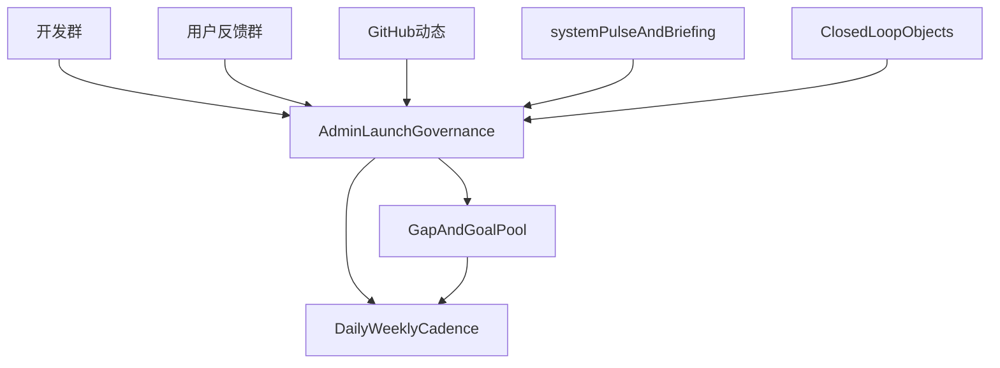

# CN KIS V2.0 上线治理 90 天行动计划

## 目标

在未来 90 天内，把 `CN KIS V2.0` 从“已有模块与数据”推进到“有统一治理平台、有持续监控节奏、有最小项目全生命周期线上闭环、有问题沉淀与目标管理”的可持续实施状态。

## 核心原则

- 统一以 [backend/configs/workstations.yaml](backend/configs/workstations.yaml) 为 19 个工作台唯一真相源。
- 统一以 `Protocol -> SchedulePlan发布 -> WorkOrder -> Enrollment -> SubjectCheckin -> Deviation/Quality` 作为最小闭环主链，避免双轨推进。
- 统一把飞书开发群、用户反馈群、GitHub、系统脉搏和关键业务对象纳入监控范围，不再只靠聊天上下文。
- 鹿鸣只做治理编排与沉淀，不重复造各业务台已有能力。

## 现状基线

- 鹿鸣现有菜单、路由和治理权限入口位于 [workstations/admin/src/layouts/AppLayout.tsx](workstations/admin/src/layouts/AppLayout.tsx)、[workstations/admin/src/App.tsx](workstations/admin/src/App.tsx)、[backend/apps/identity/api.py](backend/apps/identity/api.py)。
- 鹿鸣当前仍残留 `V1.0` 与 `15 台` 旧语义，见 [workstations/admin/src/pages/DashboardPage.tsx](workstations/admin/src/pages/DashboardPage.tsx)、[workstations/admin/src/pages/WorkstationOverviewPage.tsx](workstations/admin/src/pages/WorkstationOverviewPage.tsx)、[workstations/admin/src/pages/PilotConfigPage.tsx](workstations/admin/src/pages/PilotConfigPage.tsx)。
- 持续监控现成能力已存在于 [backend/apps/knowledge/api_system_pulse.py](backend/apps/knowledge/api_system_pulse.py)、[backend/apps/secretary/briefing_tasks.py](backend/apps/secretary/briefing_tasks.py)、[.github/workflows/feishu-notify.yml](.github/workflows/feishu-notify.yml)、[backend/config/celery_config.py](backend/config/celery_config.py)。
- 最小闭环对象链和服务入口已存在于 [backend/apps/protocol/](backend/apps/protocol)、[backend/apps/scheduling/](backend/apps/scheduling)、[backend/apps/workorder/](backend/apps/workorder)、[backend/apps/subject/](backend/apps/subject)、[backend/apps/quality/](backend/apps/quality)。

## 监控范围

- 飞书：`CN_KIS_PLATFORM开发小组`、`CN KIS 用户反馈群`
- GitHub：Issue、PR、提交、CI/部署结果
- 系统：`system-pulse`、V2 adoption、工作台配置与活跃度、知识健康、pending insights
- 关键对象：`Protocol`、`SchedulePlan`、`WorkOrder`、`Enrollment`、`SubjectCheckin`、`Deviation`
- 关键人：工作台 owner / 关键负责人在群内形成的明确结论与行动项

## 目标架构

## 行动分期

### 第 1 阶段：0-30 天，统一事实源与治理入口

目标：先把“怎么看、看什么、在哪看”统一，避免继续靠分散消息推进。

行动：

- 统一 19 台真相源，清理鹿鸣中的 `V1.0`、`15 台`、旧治理语义，重点对齐 [workstations/admin/src/pages/DashboardPage.tsx](workstations/admin/src/pages/DashboardPage.tsx)、[workstations/admin/src/pages/WorkstationOverviewPage.tsx](workstations/admin/src/pages/WorkstationOverviewPage.tsx)、[workstations/admin/src/pages/PilotConfigPage.tsx](workstations/admin/src/pages/PilotConfigPage.tsx)、[workstations/secretary/src/pages/PortalPage.tsx](workstations/secretary/src/pages/PortalPage.tsx)。
- 明确鹿鸣升级目标为“V2.0 公司上线治理操作台”，新增 `上线治理` 菜单组，第一批只做 `V2总览`、`闭环推进`、`工作台上线地图`。
- 以 [backend/apps/knowledge/api_system_pulse.py](backend/apps/knowledge/api_system_pulse.py) 与 [backend/apps/secretary/briefing_tasks.py](backend/apps/secretary/briefing_tasks.py) 为基础，定义鹿鸣聚合视图所需的统一口径字段。
- 统一早晚报主口径，明确 GitHub Actions 卡片与 Celery briefing 的主从关系，避免重复与口径冲突。
- 建立“每日推进事实清单”：开发群、用户反馈群、GitHub、system-pulse、闭环对象数据每天至少各有一处事实输入。

验收：

- 鹿鸣口径完全切换为 `V2.0` 与 `19 个工作台`。
- 开发群每日能基于统一页面回答：当前阶段、主闭环状态、今日阻塞、今日动作。
- 早晚报不再双轨冲突。

### 第 2 阶段：31-60 天，跑通最小闭环并沉淀问题池

目标：让最小项目全生命周期闭环从“代码具备”变成“真实可验证”。

行动：

- 锁定主链为 `Protocol -> publish SchedulePlan -> generate WorkOrder -> EnrollmentStatus.ENROLLED -> SubjectCheckin -> Deviation/Quality`，重点核对 [backend/apps/scheduling/services.py](backend/apps/scheduling/services.py)、[backend/apps/workorder/services/generation_service.py](backend/apps/workorder/services/generation_service.py)、[backend/apps/subject/services/recruitment_service.py](backend/apps/subject/services/recruitment_service.py)、[backend/apps/quality/services/quality_gate_service.py](backend/apps/quality/services/quality_gate_service.py)。
- 验证排程发布前门禁、入组状态、工单生成条件、签到与工单绑定、偏差闭环口径，形成一套“最小闭环验收脚本/检查清单”。
- 在鹿鸣新增 `问题与缺口` 第一版，沉淀群里和系统里出现的关键阻塞，至少支持：类型、严重度、闭环节点、工作台、责任域、下一步动作、验收状态。
- 将用户反馈群中的高相关反馈转入问题池，与 GitHub issue/PR 建立关联规则。
- 将工作台 owner 的关键结论转为结构化条目，而不是留在消息里。

验收：

- 至少 1 条真实主链能被完整验证，不再停留在单点对象存在。
- 问题不再只存在于飞书消息，能在鹿鸣中追踪打开天数、责任域与验证状态。
- 用户反馈、GitHub、系统异常三类信息能够汇总到同一问题池。

### 第 3 阶段：61-90 天，形成持续治理节奏与智能增强入口

目标：让治理平台具备持续推进能力，而不是一次性项目看板。

行动：

- 在鹿鸣新增 `目标与节奏` 页面，把阶段目标、本周目标、差距、动作、待验收事项长期显性化。
- 固定周节奏：每周一更新阶段目标与重点问题；每日基于开发群与系统事实刷新重点动作；周末也保持自动监控与异常沉淀。
- 打通 `pending_insights`、`data-insight` issue、开发群关键讨论三类洞察的统一编号或映射规范，减少遗漏。
- 把工作台推进分层：主链推进台、关键支撑台、治理与智能增强台，形成不同推进节奏。
- 识别适合引入智能体的场景，但只在主闭环与问题池稳定后进入第二优先级推进。

验收：

- 鹿鸣可以持续展示历史、现状、目标、问题和动作，不依赖人工翻聊天记录恢复上下文。
- 每周能够回答：哪个节点进展了、哪个问题久拖未决、哪一台已进入真实上线阶段、下一周最该推什么。
- 关键洞察可沉淀、可复查、可关联到对象和责任域。

## 关键工作流

### 持续监控工作流

- 飞书开发群：关注推进结论、阻塞、认领动作、部署/回滚/权限/性能讨论
- 用户反馈群：关注分类结果、重复投诉、反馈 SLA、是否影响闭环
- GitHub：关注开放 PR、stale PR、issue 新增/关闭、CI/部署失败
- system-pulse/briefing：关注成熟度变化、knowledge health、pending insights、recommended actions
- 业务对象：关注 `Protocol`、`SchedulePlan`、`WorkOrder`、`Enrollment`、`SubjectCheckin`、`Deviation` 的真实流动

### 治理沉淀工作流

- 每日：从群、GitHub、系统指标和业务对象中提取事实 -> 更新鹿鸣重点动作/阻塞
- 每周：更新阶段目标、问题池优先级、工作台上线层级
- 每月：复盘主闭环推进、问题滞留、监控盲区、智能体机会

## 风险与前置核查

- [backend/apps/core/workstation_keys.py](backend/apps/core/workstation_keys.py) 仍残留 `governance` 常量，需与 `admin` 规范统一，否则治理语义会继续混乱。
- [backend/apps/identity/migrations/0009_migrate_admin_iam_to_governance.py](backend/apps/identity/migrations/0009_migrate_admin_iam_to_governance.py) 说明历史数据仍有 legacy key 风险，需纳入前置检查。
- [workstations/admin/src/pages/PilotConfigPage.tsx](workstations/admin/src/pages/PilotConfigPage.tsx) 与 [backend/apps/identity/api.py](backend/apps/identity/api.py) 的 `workstation-config` 契约存在不一致，属于第一阶段必须核对的高优先级风险。
- `project_full_link` 与 `Protocol` 并行语义需明确主入口，否则闭环目标会分裂。

## 首批建议落地范围

- 鹿鸣：`V2总览`、`闭环推进`、`工作台上线地图`
- 监控：统一早晚报主口径，明确系统脉搏与 GitHub/飞书的对应关系
- 问题池：第一版先支持高优先级阻塞，不追求一开始全量复杂流程
- 验收：先做“最小闭环真实可验证”，再扩到 19 台全面治理

