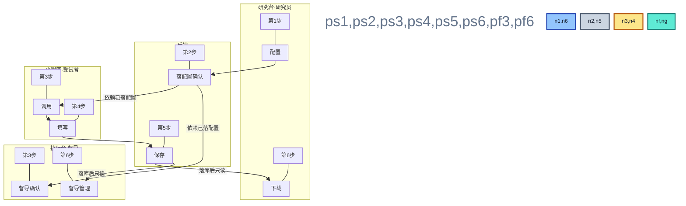

# 小程序日记开发整体需求 · 图

> **配套文档**：总体规划与版本里程碑见 [`小程序日记开发整体需求.md`](./小程序日记开发整体需求.md)。  
> **制图规范**：`docs/MERMAID_DIAGRAM_STYLE.md` §0。  
> **预览**：`Ctrl + Shift + V`（需支持 Mermaid 的 Markdown 预览插件）。

---

## 一、图 1 硬性要求与怎么读

> **硬性要求：** ① 图内**零英文**。② **`htmlLabels: false`**，节点**不用 ` `**。③ **第N步与彩框并排**，步骤字约为框内**三倍**；**节点正文极短**（每框约 **≤6 个汉字**），**防出框**。④ **四模块各一块子图**：研究台、后端、小程序、执行台**不拆成两处**；**角色**写在子图标题（研究员、督导、受试者）。⑤ **主链六步**与下表一致。

**怎么读：**

- **图 1**：六步主链；四模块各一块子图；图中**零英文**、节点**短词**防出框。
- **简表**：每步只保留 **传输内容**、**操作端**、**触发人**、**实现路径**（不写具体接口路径/代码字段名）。

**出框与排版：** 遵守 **`docs/MERMAID_DIAGRAM_STYLE.md` §0**（**图中零英文**、**禁止出框**、**第N步**与表对应）。

**架构选择（已定稿）：** **统一后端 + 共享前端模块（双入口）+ 角色差异化**——研究员在研究台维护配置并**查看、下载、稽查**落库数据；督导在执行台确认配置、看进度与待提醒清单；**不整页复刻两套业务代码**。（接口与字段**不在图中写**，见 **`docs/小程序日记功能2.0.md`**。）

**版本分阶段（与总体规划一致）：**

- **2.0**：配置**上线确认门禁**由**研究员**完成（落在后端「第2步·落配置与确认」）；小程序与研究台数据链可先跑通。**图中执行台「督导确认」「督导管理」分支属目标架构**，**2.0 实现可不依赖**（执行台页面可后置）。
- **3.0**：督导**可选二次确认**、**质疑打回**、进度与管理等与后端完整打通；详见 [`小程序日记开发整体需求.md`](./小程序日记开发整体需求.md) §3.3。

---

## 二、主链路：双入口 + 小程序 + 统一后端

**结构说明（与图中步骤编号一致）：**

1. **研究台配置**（第1步）。  
2. **后端落配置与确认**（第2步）。  
3. **小程序调用** 与 **执行台督导确认配置**（第3步，**两路并行**，均**依赖第2步已写入后端的配置**；**执行台这一路为 3.0 完整能力**，2.0 仅须小程序这一路）。  
4. **受试者填写**（第4步）。  
5. **后端保存数据**（第5步）。  
6. **研究台数据下载** 与 **执行台督导管理**（第6步，**落库后**经后端只读分流，见下表）。  
7. **受试者不登录**工作台；小程序**只调后端**。

**读图：** 四个子图对应 **研究台、后端、小程序、执行台**（各一块）；子图标题为**角色**；彩框为**短词**，与下表「环节」同义。

---

## 三、步骤说明（传输 · 端 · 人 · 路径）

**顺序：** 第1步 → 第2步 → 第3步（小程序与执行台两路并行，均依赖第2步已落配置；**2.0 可仅实现小程序这一路**）→ 第4步 → 第5步 → 第6步（研究台与执行台两路分流，均依赖第5步已落库，只读；**执行台这一路完整能力属 3.0**）。

| 步骤 | 环节 | 传输内容（传什么） | 操作端 | 谁触发 | 实现路径（怎么走） |
|:----:|------|-------------------|--------|--------|-------------------|
| **1** | 研究台配置 | 日记规则与题目、时间窗、推送策略、生效范围等配置数据 | 采苓·研究台（飞书网页） | 研究员（或项目管理员等有权限人员） | 研究台页面操作 → **加密访问后端** → 后端校验并落库 |
| **2** | 后端落配置与确认 | 配置与确认记录落库；向前端返回成功/可用；对小程序聚合「生效配置」视图 | 增强后端（服务） | 系统（承接第1步；**2.0：研究员确认写入本端**；**3.0：可增加督导在执行台的确认记录写入本端**） | 写数据库；对外统一查询与下发 |
| **3·小程序** | 小程序调用 | 拉今日任务、题目与策略等（须第2步配置已就绪） | 微信小程序 | 受试者 | 小程序 → **加密访问后端** → 取配置与任务 |
| **3·执行台** | 督导确认配置（**3.0**） | 看配置快照；提交确认与放行（须第2步配置已就绪）；**可选**二次确认，由项目策略决定 | 维周·执行台（飞书网页） | 督导（或 PM 等） | 执行台页面 → **加密访问后端** → 更新确认记录 |
| **4** | 受试者填写 | 各题答案、日记日期、补填说明等 | 微信小程序 | 受试者 | 端内填写 → **加密提交** 后端 |
| **5** | 后端保存数据 | 日记条目落库、索引与审计 | 增强后端（服务） | 系统（承接第4步提交） | 写库并返回结果 |
| **6·研究台** | 研究台数据下载 | 列表、筛选、导出文件等（只读已落库数据） | 采苓·研究台 | 研究员、监查员等 | 研究台页面 → **加密查询后端** → 读库返回；**不经小程序** |
| **6·执行台** | 执行台督导管理（**3.0**） | 完成进度、待跟进、**质疑打回**等（只读或经后端允许的更新） | 维周·执行台 | 督导、CRC 等 | 执行台页面 → **加密访问后端**；与消息推送可同源 |

**说明：** 「路径」只写到**经统一后端、加密传输**，不写具体网址、接口名或报文字段；字段与接口细节见 **`docs/小程序日记功能2.0.md`** 与部署说明。

---

*字段级清单以《小程序日记功能 2.0》及代码侧接口契约为准。*
